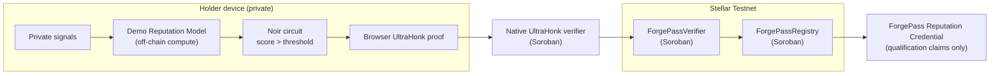
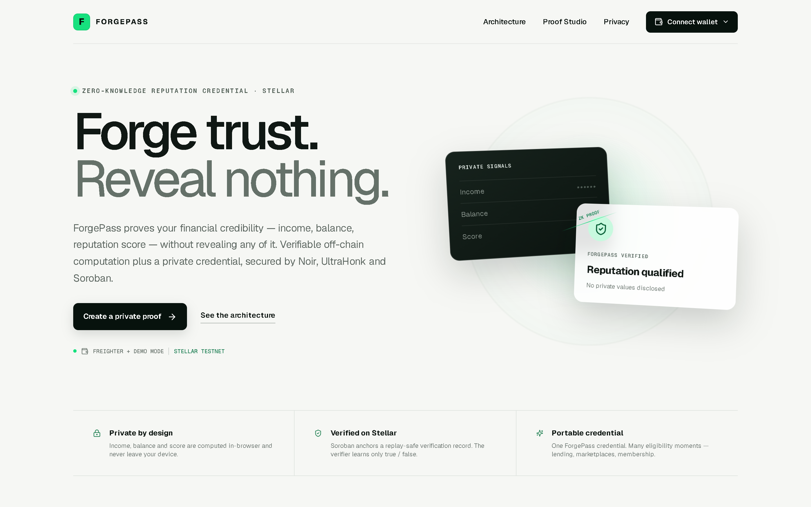
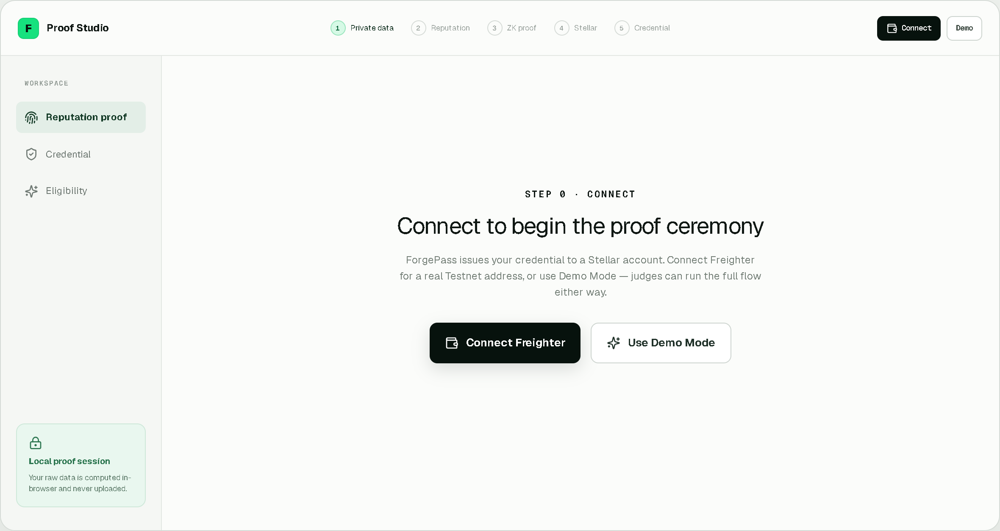
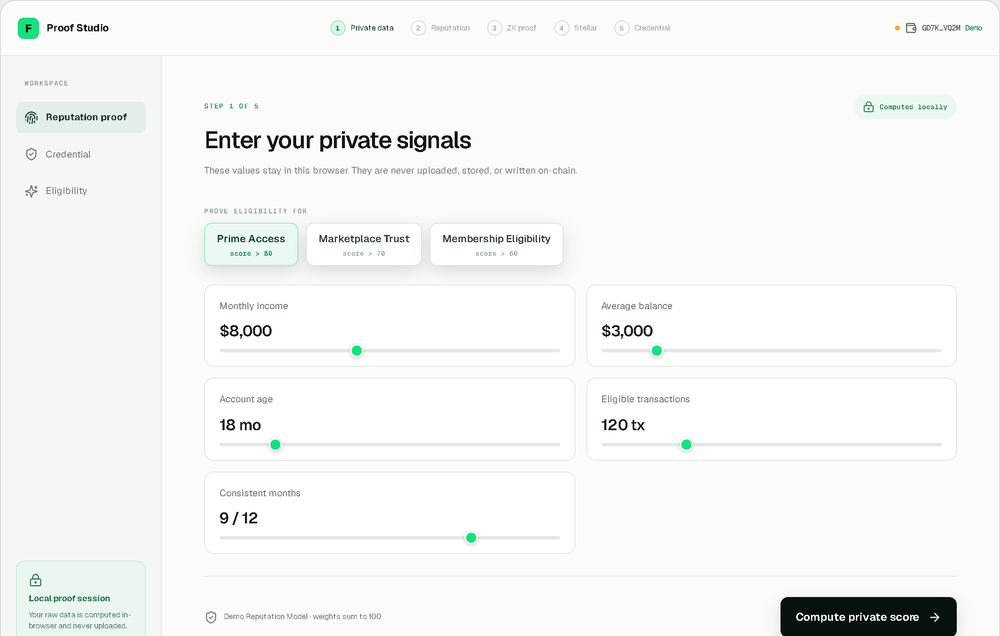
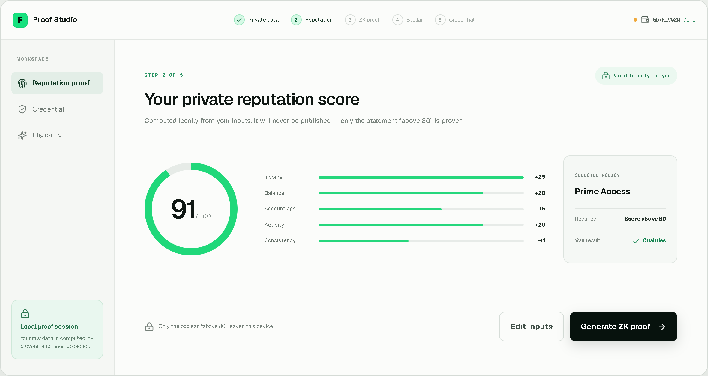
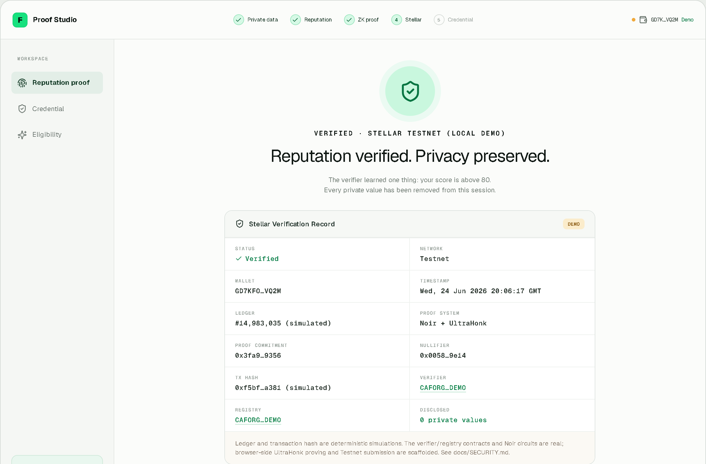
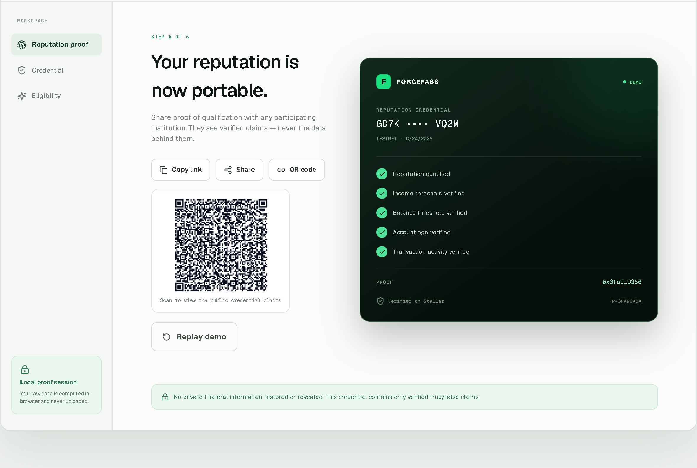

# ForgePass

**Private financial reputation credentials on Stellar. Prove trust. Reveal nothing.**

ForgePass lets a person prove they satisfy a financial trust policy, for example **"my reputation score is above 80"**, without revealing the private inputs behind that result: income, balance, account age, transaction activity, consistency, or even the exact score.

The verifier gets one useful answer: **qualified / not qualified**. The holder keeps the data.

> Live demo: https://forge-pass.vercel.app/

## What Judges Should Understand In 30 Seconds

- **What it does:** ForgePass turns private financial signals into a portable reputation credential.
- **Why ZK is essential:** without zero-knowledge proofs, the user must expose raw financial data to earn trust. With ZK, the user proves only the policy result.
- **Why Stellar:** Stellar gives the credential wallet binding, low-cost public verification rails, fast settlement, and Soroban contracts for replay protection and registry state.
- **What is live:** ForgePass verifier, registry, and VK-backed native UltraHonk verifier contracts are deployed on Stellar Testnet and can be inspected in Stellar Expert.
- **What is wired now:** browser UltraHonk proof generation is live in the frontend, and Freighter wallet mode submits a fresh native `verify_proof` transaction to the VK-backed verifier. Demo Mode cannot sign, so it displays the verified milestone transaction.

## Judge Verification Checklist

1. Open the app and read the hero: **Private financial reputation credentials on Stellar. Prove trust. Reveal nothing.**
2. Run the Proof Studio with Freighter on Testnet or labeled Demo Mode.
3. Enter private income, balance, account age, activity, and consistency.
4. Confirm the score is computed locally and only the threshold claim continues.
5. Confirm the live Stellar Testnet contract IDs and Stellar Expert links are visible.
6. Confirm browser UltraHonk proving is real, Freighter submission is live, and Demo Mode transaction values are labeled honestly.
7. Run `npm run verify:live` to confirm all three deployed Soroban contracts exist on Testnet.

## Why Zero-Knowledge Is The Point

Financial reputation normally requires over-disclosure. A lender, marketplace, or membership app may only need to know whether someone qualifies, but today it often asks for bank statements, income documents, balances, transaction histories, and exact scores.

ForgePass changes the trust primitive:

```text
Old flow: disclose private data -> verifier decides whether to trust you
ForgePass: keep data private -> prove the policy result -> share the credential
```

The Noir circuit is the enforceable rule: recompute the reputation predicate and prove `score > threshold` without revealing the witnesses. The public outputs are commitments, holder binding, nullifier, policy metadata, and the boolean result. That is why ZK is not decoration here; it is the privacy boundary.

## Why Stellar Is The Right Chain

ForgePass needs a public network that can make credentials portable without making them expensive or slow to check. Stellar fits because:

- **Wallet identity:** credentials can bind to Stellar accounts instead of app-specific accounts.
- **Soroban contracts:** verifier and registry contracts can consume nullifiers, prevent replay, emit events, and manage credential state.
- **Low fees and fast finality:** financial reputation checks can happen repeatedly without turning verification into a cost center.
- **Stellar Expert transparency:** judges and integrators can inspect deployed Testnet contracts directly.
- **Financial alignment:** Stellar already targets payments, wallets, ramps, and real-world financial access, which matches ForgePass's credential use case.

## Live Stellar Testnet Deployment

- Network: **Stellar Testnet**
- RPC: `https://soroban-testnet.stellar.org`
- Verifier contract: `CCNNXYINWM3QNC3HNKOU66XCJP5GJMZYMSMXYBZALT4U24AXN6RAPXNF`
- Registry contract: `CABRLKSOTTR3YSMXQUPLTBR3QBDIOC5SLPIIX7VI2JPLLTHWL4BQBDOT`
- Native UltraHonk verifier contract: `CA4WPPLXN4HSQBLB23ZVCLG5PZ6G5SD3R2BWMSMDY6OVRLFONDAMSMK2`
- Verifier explorer: https://stellar.expert/explorer/testnet/contract/CCNNXYINWM3QNC3HNKOU66XCJP5GJMZYMSMXYBZALT4U24AXN6RAPXNF
- Registry explorer: https://stellar.expert/explorer/testnet/contract/CABRLKSOTTR3YSMXQUPLTBR3QBDIOC5SLPIIX7VI2JPLLTHWL4BQBDOT
- Native UltraHonk explorer: https://stellar.expert/explorer/testnet/contract/CA4WPPLXN4HSQBLB23ZVCLG5PZ6G5SD3R2BWMSMDY6OVRLFONDAMSMK2
- Native proof verification tx: https://stellar.expert/explorer/testnet/tx/733a10034fbd11cb8a588d7fcc98af30a9d25f7d844c4a2beca65fd15f5a61f5

The deployed contracts currently provide the Soroban surface for replay-safe verifier receipts and holder credential registry state:

- `ForgePassVerifier` consumes nullifiers, enforces verifier/holder authorization, expiry, pause, and replay checks.
- `ForgePassRegistry` creates holder passports, registers claims, and supports revocation.

Run the live check:

```bash
npm run verify:live
```

## Native UltraHonk Status

ForgePass now has a deployed VK-backed native UltraHonk verifier milestone for the full `circuits/trust_score_proof` circuit.

- Circuit: `circuits/trust_score_proof`
- Proving system: Noir `1.0.0-beta.9` + Barretenberg `0.87.0` UltraHonk with `--oracle_hash keccak`
- Artifacts: `artifacts/ultrahonk/trust_score_proof/`
- Verifier Wasm: `artifacts/soroban/native-ultrahonk/rs_soroban_ultrahonk.wasm`
- Native verifier contract: `CA4WPPLXN4HSQBLB23ZVCLG5PZ6G5SD3R2BWMSMDY6OVRLFONDAMSMK2`
- Explorer: https://stellar.expert/explorer/testnet/contract/CA4WPPLXN4HSQBLB23ZVCLG5PZ6G5SD3R2BWMSMDY6OVRLFONDAMSMK2
- Successful `verify_proof` transaction: https://stellar.expert/explorer/testnet/tx/733a10034fbd11cb8a588d7fcc98af30a9d25f7d844c4a2beca65fd15f5a61f5

Environment variable:

```bash
NEXT_PUBLIC_FORGEPASS_NATIVE_ULTRAHONK_CONTRACT_ID=CA4WPPLXN4HSQBLB23ZVCLG5PZ6G5SD3R2BWMSMDY6OVRLFONDAMSMK2
NEXT_PUBLIC_FORGEPASS_NATIVE_ULTRAHONK_TX_HASH=733a10034fbd11cb8a588d7fcc98af30a9d25f7d844c4a2beca65fd15f5a61f5
```

`npm run verify:live` verifies the ForgePass verifier, registry, and native UltraHonk verifier contract instances on Stellar Testnet.

## Demo Flow

1. Connect wallet or use Demo Mode.
2. Enter private financial inputs.
3. Compute the private trust score locally.
4. Generate the browser UltraHonk proof.
5. Submit `verify_proof` with Freighter or inspect the verified milestone transaction in Demo Mode.
6. Export/share the credential.

A longer recording script lives at [`docs/demo-video-script.md`](docs/demo-video-script.md), with a shorter live walkthrough in [`docs/DEMO.md`](docs/DEMO.md).

## What Is Real vs Limited

**Real:** frontend Proof Studio, deterministic reputation scoring model, Noir circuits/tests, browser UltraHonk proof generation, Freighter-signed native `verify_proof` transaction submission, Barretenberg UltraHonk artifacts for `trust_score_proof`, Soroban verifier/registry contracts, deployed VK-backed native UltraHonk verifier, committed Soroban Wasm artifacts, and verified Stellar Testnet deployments.

**Limited:** Demo Mode cannot sign fresh Testnet transactions, so it displays the verified milestone transaction. Fresh on-chain submission requires a connected Freighter Testnet account, funded account state, the public native verifier env vars, and a working Testnet RPC.

**Production requirement:** ForgePass proves a predicate over supplied data. In production, data truth comes from signed attestations by banks, payroll providers, employers, or trusted issuers.

## The problem

Every financial application asks people to *surrender data to earn trust*: upload
bank statements, share income, expose transaction history. That data is copied,
stored, and breached. The applicant over-shares; the institution over-collects.

The institution rarely needs the data. It needs the **answer**: *does this person
qualify?* ForgePass replaces data disclosure with a cryptographic proof of the
answer.

## The solution

```
Private data ─▶ Off-chain reputation computation ─▶ Noir circuit
   ─▶ browser UltraHonk proof ─▶ native Soroban verifier ─▶ ForgePass credential
```

1. The holder enters private signals (income, balance, age, activity, consistency).
2. ForgePass computes a **reputation score (0–100)** locally, in the browser.
3. The Noir circuit constrains the same `score > threshold` predicate and emits only public commitments and the qualification result.
4. The browser generates an UltraHonk proof and Freighter wallet mode submits the proof bytes and public inputs to the deployed native Soroban verifier.
5. The private values are discarded and a **ForgePass Reputation Credential** preview is issued.

The memorable moment: the private inputs and the score **disappear** after proving, and a
credential appears — *"Credential Ready. Privacy Preserved."*

---

## Architecture



| Layer | Technology | Role |
| --- | --- | --- |
| App | Next.js 15 · React 19 · TypeScript | Interactive Proof Studio, wallet UX |
| Wallet | `@stellar/freighter-api` + Demo Mode | Real Testnet address or simulated session |
| Off-chain compute | `lib/domain` | Deterministic reputation model + canonical vectors |
| Circuits | Noir (`v1.0.0-beta.22`) | Five threshold predicates incl. flagship score circuit |
| Proof system target | UltraHonk | Browser proof generation with Barretenberg artifacts for `trust_score_proof`; Freighter mode submits proof bytes to Soroban |
| Verification surface | Soroban (Rust, `wasm32v1-none`) | Live replay-safe verifier + credential registry contracts + deployed native UltraHonk verifier |
| Commitments | Web Crypto SHA-256 | Public-input commitment, holder binding, nullifier |

---

## Reputation engine (off-chain computation)

The score is a deterministic, capped linear model — clearly labeled the
**"Demo Reputation Model"**, not a real credit score. Weights sum to 100:

| Component | Weight | Target (full points) |
| --- | --- | --- |
| Income | 25 | $8,000 / month |
| Balance | 20 | $3,000 average |
| Account age | 20 | 24 months |
| Transaction activity | 20 | 120 tx / year |
| Financial consistency | 15 | 12 / 12 months |

The exact arithmetic is implemented **twice** and kept in lockstep:

- `lib/domain/trust-score.ts` — the in-browser computation (with tests).
- `circuits/trust_score_proof/src/main.nr` — the Noir circuit that *proves* it.

This is what makes the off-chain computation *verifiable*: the value computed on
the device is the same value the circuit constrains, so it can be proven without
being revealed. The canonical demo vector scores **91**.

## Noir circuits

`circuits/` contains five predicate circuits. Each reveals only `threshold`,
`policy_commitment`, `holder_binding`, `nullifier`, and `qualified` — never a
private input.

- `income_proof`, `balance_proof`, `account_age_proof`, `transaction_volume_proof`
- `trust_score_proof` — **flagship**: recomputes the full reputation score from
  private witnesses and proves `score > threshold` with `qualified == true`. It
  ships with a passing score-91 vector and an expected-failure low-score vector.

Build/test with a pinned `nargo` (see `docs/BUILD.md`):

```bash
cd circuits/trust_score_proof && nargo test && nargo compile
```

## UltraHonk verification

ForgePass targets the UltraHonk proving system and a Soroban UltraHonk verifier.
The integration follows the reference implementations:

- Primary: https://github.com/yugocabrio/rs-soroban-ultrahonk (off-chain Rust verifier)
- Secondary: https://github.com/indextree/ultrahonk_soroban_contract (on-chain contract)

The intended on-chain interface mirrors the reference verifier contract:

- The **verification key is fixed at deploy time** (constructor argument), one
  deployment per circuit.
- A `verify_proof(public_inputs, proof_bytes)` entrypoint returns `Result<(), Error>`; the transaction fails if the proof is invalid or the public inputs do not match the deployed verification key.
- Proof artifacts are generated with Barretenberg using `--oracle_hash keccak`,
  because the contract delegates hashing to Soroban's native **Keccak-256** and
  implements BN254 curve ops against the Protocol 25 host functions
  (`g1_add`, `g1_mul`, `pairing_check`). Those host functions are what make this
  feasible: a naive `ark_bn254` pairing costs ≈560M instructions — over Soroban's
  100M budget — whereas the native path lands near ~112M and shrinks the contract
  from ~130 KB to ~15 KB.

ForgePass now includes a deployed native UltraHonk verifier using this interface. The verifier was deployed with the `trust_score_proof` VK and successfully invoked on Stellar Testnet with generated proof bytes and public inputs. The frontend now generates browser UltraHonk proofs and, when Freighter is connected on Testnet, submits a fresh native `verify_proof` transaction. Demo Mode cannot sign and therefore displays the verified milestone transaction.

## Soroban contracts

`contracts/` builds two size-optimized Wasm contracts (`wasm32v1-none`):

- **ForgePassVerifier** — verifies a proof receipt, enforces time bounds, and
  **consumes a nullifier for replay protection**, emitting a `proof_verified`
  event. Admin can pause and rotate the verifier role.
- **ForgePassRegistry** — issues a holder passport and registers / revokes
  credential claims, tracking verification history.

Neither contract ever stores income, balance, transactions, or the score — only
proof metadata, commitments, nullifiers, and credential records.

## Stellar wallet integration

Built on `@stellar/freighter-api` (Stellar Wallets Kit pattern):

- Wallet detection, connect, get public key, get network, disconnect.
- Session persistence across reloads (`localStorage`).
- Wallet status surfaced in the navigation **and** the Proof Studio.
- **Demo Mode** for judges: a fully simulated session so the entire flow runs
  with no extension installed. It is always labeled "Demo".

---

## Screenshots

The full proof ceremony — private data in, cryptographic proof out, credential issued.

| | |
| --- | --- |
|  |  |
| **Landing** — the hero and the private-data → credential pipeline. | **Connect** — run the flow with Freighter *or* labeled Demo Mode. |
|  |  |
| **Reputation engine** — local off-chain compute over private signals. | **Score** — a private 91 qualifies for `score > 80`; only the boolean leaves. |
|  |  |
| **Stellar verification** — replay-safe record; simulated values are labeled. | **Credential** — verified claims only, with share + QR. **0 private values disclosed.** |

> Regenerate from the running app with `node scripts/capture-screenshots.mjs`
> (drives system Chrome through the live flow; see the script header).

---

## What is real vs. limited

Honesty is a feature. The UI labels Demo Mode values clearly.

**Real / implemented**
- Interactive in-browser reputation computation with live score + breakdown.
- Freighter wallet connect + Demo Mode, with persisted sessions.
- Browser UltraHonk proof generation using NoirJS and Barretenberg.
- Freighter-signed native `verify_proof` transaction submission to Stellar Testnet.
- SHA-256 public-input commitment, holder binding, and replay nullifier (Web Crypto).
- Five Noir circuits with passing tests + committed ACIR artifacts.
- Two ForgePass Soroban contracts with replay protection + committed Wasm artifacts, deployed on Stellar Testnet.
- A VK-backed native UltraHonk verifier contract deployed on Stellar Testnet for `trust_score_proof`.
- Privacy-minimized Prisma schema; 25 unit tests across model, policy, and proof, including a 1,280-vector circuit-parity grid and threshold-boundary checks.

**Limited / clearly labeled**
- Demo Mode cannot sign transactions, so it uses deterministic ledger and transaction display values and links to the verified native UltraHonk milestone transaction.
- Fresh on-chain submission requires Freighter on Testnet, a funded account, configured public native verifier env vars, and a healthy Testnet RPC.

**Future production work**
- Signed source attestations and an independently operated verifier quorum.

See `docs/SECURITY.md` for the full trust model.

---

## Quick start

```bash
npm install
npm run dev          # http://localhost:3000
```

Submission checks:

```bash
npm run typecheck
npm run lint
npm test
npm run build
npm run verify:live
```

Optional: connect [Freighter](https://www.freighter.app/) on Testnet, or click
**Demo Mode** to run the flow with no extension.


### Native UltraHonk verifier deployment

Status: deployed on Stellar Testnet as a native verifier milestone for the full `circuits/trust_score_proof` circuit, using Noir `1.0.0-beta.9` and Barretenberg `0.87.0` to match the rs-soroban-ultrahonk reference flow.

- Contract ID: `CA4WPPLXN4HSQBLB23ZVCLG5PZ6G5SD3R2BWMSMDY6OVRLFONDAMSMK2`
- Explorer: https://stellar.expert/explorer/testnet/contract/CA4WPPLXN4HSQBLB23ZVCLG5PZ6G5SD3R2BWMSMDY6OVRLFONDAMSMK2
- Successful `verify_proof` transaction: https://stellar.expert/explorer/testnet/tx/733a10034fbd11cb8a588d7fcc98af30a9d25f7d844c4a2beca65fd15f5a61f5
- Artifacts: `artifacts/ultrahonk/trust_score_proof/`
- Wasm: `artifacts/soroban/native-ultrahonk/rs_soroban_ultrahonk.wasm`

Keep these public env vars set in Vercel/Railway:

```bash
NEXT_PUBLIC_FORGEPASS_NATIVE_ULTRAHONK_CONTRACT_ID=CA4WPPLXN4HSQBLB23ZVCLG5PZ6G5SD3R2BWMSMDY6OVRLFONDAMSMK2
NEXT_PUBLIC_FORGEPASS_NATIVE_ULTRAHONK_TX_HASH=733a10034fbd11cb8a588d7fcc98af30a9d25f7d844c4a2beca65fd15f5a61f5
```

`npm run verify:live` verifies all three Testnet contracts. Successful submitted transactions use the CTA **View in Stellar Expert Testnet Explorer**.
### Vercel / Railway redeploy

ForgePass is safe to redeploy without local Soroban tooling. Vercel only needs the public Next.js variables below; it does not need Docker, Cargo, Stellar CLI, or private keys for the current frontend demo.

```bash
NEXT_PUBLIC_STELLAR_NETWORK=Testnet
NEXT_PUBLIC_STELLAR_RPC_URL=https://soroban-testnet.stellar.org
NEXT_PUBLIC_FORGEPASS_VERIFIER_ID=CCNNXYINWM3QNC3HNKOU66XCJP5GJMZYMSMXYBZALT4U24AXN6RAPXNF
NEXT_PUBLIC_FORGEPASS_REGISTRY_ID=CABRLKSOTTR3YSMXQUPLTBR3QBDIOC5SLPIIX7VI2JPLLTHWL4BQBDOT
NEXT_PUBLIC_FORGEPASS_NATIVE_ULTRAHONK_CONTRACT_ID=CA4WPPLXN4HSQBLB23ZVCLG5PZ6G5SD3R2BWMSMDY6OVRLFONDAMSMK2
NEXT_PUBLIC_FORGEPASS_NATIVE_ULTRAHONK_TX_HASH=733a10034fbd11cb8a588d7fcc98af30a9d25f7d844c4a2beca65fd15f5a61f5
```

Use Railway only if you add a future backend attestation or issuer service. The current public web app does not need verifier/operator secrets: Freighter signs user-initiated native `verify_proof` submissions from the browser.

Lightweight live deployment check:

```bash
npm run verify:live
```
### Refresh the Testnet deployment (optional)

The verifier + registry are already deployed on Stellar Testnet. To redeploy or refresh live contract IDs, run the deploy script. No secret key leaves your machine — the script creates and [Friendbot](https://developers.stellar.org/docs/learn/fundamentals/networks#testnet)-funds a local Stellar identity:

```bash
# macOS / Linux / WSL          # Windows PowerShell
./scripts/deploy-testnet.sh    ./scripts/deploy-testnet.ps1
```

It prints two `NEXT_PUBLIC_FORGEPASS_*` contract IDs. Copy `.env.example` to `.env.local`, paste refreshed IDs if needed, and restart `npm run dev`. The UI links the contracts on [stellar.expert](https://stellar.expert/explorer/testnet). Freighter wallet mode submits a fresh native `verify_proof` transaction; Demo Mode still shows labeled deterministic values because it cannot sign. Requires the [Stellar CLI](https://developers.stellar.org/docs/tools/cli/install-cli).

## Repository map

- `app`, `components` — Next.js Proof Studio, wallet provider/button, verification panel, credential.
- `lib/domain` — reputation model + policies and canonical test vectors.
- `lib/proof` — commitment/nullifier derivation + verification record builder.
- `lib/wallet`, `lib/stellar` — Freighter adapter and network/contract config.
- `circuits` — Noir predicate circuits and the shared design contract.
- `contracts` — Soroban verifier and registry (Rust).
- `prisma` — privacy-minimized PostgreSQL metadata schema.
- `docs` — blueprint, build, security, demo script, demo-video script, screenshots.

## Demo script

A two-minute walkthrough lives in [`docs/DEMO.md`](docs/DEMO.md); the recording
plan is in [`docs/demo-video-script.md`](docs/demo-video-script.md).

## Security

ForgePass proves a predicate over supplied data; it does not make self-asserted
data truthful. Real deployments need signed source attestations, audited
circuits, an independently operated verifier quorum, and an explicit retention
policy. See [`docs/SECURITY.md`](docs/SECURITY.md).

## Roadmap

1. Add signed bank, payroll, employer, or oracle attestations.
2. Add an independently operated verifier/issuer model where needed.
3. Harden verifier, registry, and proof UX for Mainnet.
4. Independent circuit and contract audits.

## Limitations

Hackathon vertical slice and protocol reference. Not audited, not for production
lending, compliance, or custody. The reputation model is illustrative only.

## License

See [`LICENSE`](LICENSE).

---

**Reputation Verified. Privacy Preserved. — Forge Trust. Reveal Nothing.**

