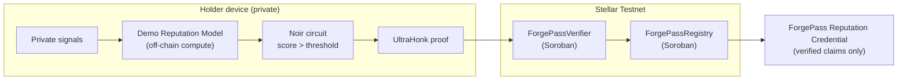

# ForgePass

**Forge Trust. Reveal Nothing.**

ForgePass is a **zero-knowledge reputation credential built on Stellar**. It lets
a person prove financial credibility — *"my reputation score is above 80"* —
without revealing their income, balance, account age, transaction activity, or
the score itself. The verifier learns exactly one thing: **true** or **false**.

> Live demo: https://forge-pass.vercel.app/

## Hackathon submission snapshot

ForgePass is **an honest, deployed Stellar Testnet vertical slice with real circuits/contracts and transparent proof-generation scaffolding**.

### Judge Verification Checklist

- Open the app and confirm the hero message: **Private financial reputation credentials on Stellar. Prove trust. Reveal nothing.**
- Confirm the **Live on Stellar Testnet** section lists both contract IDs and explorer links.
- Run the Proof Studio with Freighter on Testnet or labeled Demo Mode.
- Confirm private inputs disappear before the credential screen.
- Confirm proof-generation and transaction values are labeled simulated/scaffolded honestly.
- Review `circuits/`, `contracts/`, and `docs/BUILD.md` for reproducible circuit/contract artifacts.

### Live Deployment

- Network: **Stellar Testnet**
- RPC: `https://soroban-testnet.stellar.org`
- Verifier contract: `CCNNXYINWM3QNC3HNKOU66XCJP5GJMZYMSMXYBZALT4U24AXN6RAPXNF`
- Registry contract: `CABRLKSOTTR3YSMXQUPLTBR3QBDIOC5SLPIIX7VI2JPLLTHWL4BQBDOT`
- Verifier explorer: https://stellar.expert/explorer/testnet/contract/CCNNXYINWM3QNC3HNKOU66XCJP5GJMZYMSMXYBZALT4U24AXN6RAPXNF
- Registry explorer: https://stellar.expert/explorer/testnet/contract/CABRLKSOTTR3YSMXQUPLTBR3QBDIOC5SLPIIX7VI2JPLLTHWL4BQBDOT

The contracts currently provide the deployed Soroban surface for a replay-safe verifier receipt flow and holder credential registry. `ForgePassVerifier` consumes nullifiers and enforces verifier/holder authorization, expiry, pause, and replay checks. `ForgePassRegistry` creates holder passports, registers claims, and supports revocation.

### Environment Variables

The repo uses these public Next.js variables:

```bash
NEXT_PUBLIC_STELLAR_NETWORK=Testnet
NEXT_PUBLIC_STELLAR_RPC_URL=https://soroban-testnet.stellar.org
NEXT_PUBLIC_FORGEPASS_VERIFIER_ID=CCNNXYINWM3QNC3HNKOU66XCJP5GJMZYMSMXYBZALT4U24AXN6RAPXNF
NEXT_PUBLIC_FORGEPASS_REGISTRY_ID=CABRLKSOTTR3YSMXQUPLTBR3QBDIOC5SLPIIX7VI2JPLLTHWL4BQBDOT
```

> If copying manually, use the values from `.env.example` or `.env.local`; both contract IDs must be set for the UI to switch into live-contract mode.

### Demo Script

1. Connect wallet or use Demo Mode.
2. Enter private financial inputs.
3. Generate the private trust score.
4. Create the credential.
5. Anchor/verify against the Stellar Testnet deployment surface.
6. Export/share the credential.

A longer recording script lives at [`docs/demo-video-script.md`](docs/demo-video-script.md), with a shorter live walkthrough in [`docs/DEMO.md`](docs/DEMO.md).

### Known Limitations

- Browser-side UltraHonk proof generation is scaffolded in the demo UI.
- Frontend Testnet transaction submission and full native on-chain proof verification are not yet wired.
- ForgePass proves a predicate over supplied data. In production, data truth comes from signed attestations by banks, payroll providers, employers, or trusted issuers.
- The reputation model is a transparent demo model, not a production credit score.
- No production-readiness, audit, lending, KYC, or compliance claim is made.

### Roadmap

- Wire real browser/server proof generation from the Noir circuits and Barretenberg artifacts.
- Deploy a VK-backed native UltraHonk verifier contract and set `NEXT_PUBLIC_FORGEPASS_NATIVE_ULTRAHONK_CONTRACT_ID`.
- Add signed source attestations from banks, payroll providers, employers, and trusted issuers.
- Add independent circuit, contract, and frontend audits.
- Expand credential presentation and verifier integrations.

### What Judges Should Test

- The no-extension Demo Mode and the Freighter Testnet connection path.
- Policy selection, private input sliders, score calculation, and threshold qualification.
- Proof animation labels and the Stellar Verification Record panel.
- Contract ID explorer links and environment-driven live-contract status.
- Credential export, share, copy-link, and QR-code actions.

ForgePass is the intersection of the two official Stellar hackathon tracks:

- **Verifiable off-chain computation** — a reputation score is computed locally
  and proven correct with a Noir circuit.
- **Private credential / reputation** — the proof verification path targets Stellar and a
  privacy-preserving credential is issued.

---

## The problem

Every financial application asks people to *surrender data to earn trust*: upload
bank statements, share income, expose transaction history. That data is copied,
stored, and breached. The applicant over-shares; the institution over-collects.

The institution rarely needs the data. It needs the **answer**: *does this person
qualify?* ForgePass replaces data disclosure with a cryptographic proof of the
answer.

## The solution

```
Private data ─▶ Off-chain reputation computation ─▶ Noir circuit
   ─▶ UltraHonk proof scaffold ─▶ live Soroban contracts ─▶ ForgePass credential
```

1. The holder enters private signals (income, balance, age, activity, consistency).
2. ForgePass computes a **reputation score (0–100)** locally, in the browser.
3. The score is mapped to the public commitments a `score > threshold` proof would expose.
4. The deployed Soroban verifier/registry contract links are shown; browser proof generation and transaction submission remain scaffolded.
5. The private values are discarded and a **ForgePass Reputation Credential** preview is issued.

The memorable moment: the private inputs and the score **disappear**, and a
credential appears — *"Credential Ready. Privacy Preserved."*

---

## Architecture



| Layer | Technology | Role |
| --- | --- | --- |
| App | Next.js 15 · React 19 · TypeScript | Interactive Proof Studio, wallet UX |
| Wallet | `@stellar/freighter-api` + Demo Mode | Real Testnet address or simulated session |
| Off-chain compute | `lib/domain` | Deterministic reputation model + canonical vectors |
| Circuits | Noir (`v1.0.0-beta.22`) | Five threshold predicates incl. flagship score circuit |
| Proof system | UltraHonk | Succinct zero-knowledge proof |
| Verification surface | Soroban (Rust, `wasm32v1-none`) | Live replay-safe verifier + credential registry contracts; native UltraHonk tx path next |
| Commitments | Web Crypto SHA-256 | Public-input commitment, holder binding, nullifier |

---

## Reputation engine (off-chain computation)

The score is a deterministic, capped linear model — clearly labeled the
**"Demo Reputation Model"**, not a real credit score. Weights sum to 100:

| Component | Weight | Target (full points) |
| --- | --- | --- |
| Income | 25 | $8,000 / month |
| Balance | 20 | $3,000 average |
| Account age | 20 | 24 months |
| Transaction activity | 20 | 120 tx / year |
| Financial consistency | 15 | 12 / 12 months |

The exact arithmetic is implemented **twice** and kept in lockstep:

- `lib/domain/trust-score.ts` — the in-browser computation (with tests).
- `circuits/trust_score_proof/src/main.nr` — the Noir circuit that *proves* it.

This is what makes the off-chain computation *verifiable*: the value computed on
the device is the same value the circuit constrains, so it can be proven without
being revealed. The canonical demo vector scores **91**.

## Noir circuits

`circuits/` contains five predicate circuits. Each reveals only `threshold`,
`policy_commitment`, `holder_binding`, `nullifier`, and `qualified` — never a
private input.

- `income_proof`, `balance_proof`, `account_age_proof`, `transaction_volume_proof`
- `trust_score_proof` — **flagship**: recomputes the full reputation score from
  private witnesses and proves `score > threshold` with `qualified == true`. It
  ships with a passing score-91 vector and an expected-failure low-score vector.

Build/test with a pinned `nargo` (see `docs/BUILD.md`):

```bash
cd circuits/trust_score_proof && nargo test && nargo compile
```

## UltraHonk verification

ForgePass targets the UltraHonk proving system and a Soroban UltraHonk verifier.
The integration follows the reference implementations:

- Primary: https://github.com/yugocabrio/rs-soroban-ultrahonk (off-chain Rust verifier)
- Secondary: https://github.com/indextree/ultrahonk_soroban_contract (on-chain contract)

The intended on-chain interface mirrors the reference verifier contract:

- The **verification key is fixed at deploy time** (constructor argument), one
  deployment per circuit.
- A `verify_proof(proof, public_inputs)` entrypoint returns a boolean; the tx
  **reverts** if the proof is invalid or the public inputs don't match the claim
  (a companion `is_verified` reads back the result).
- Proof artifacts are generated with Barretenberg using `--oracle_hash keccak`,
  because the contract delegates hashing to Soroban's native **Keccak-256** and
  implements BN254 curve ops against the Protocol 25 host functions
  (`g1_add`, `g1_mul`, `pairing_check`). Those host functions are what make this
  feasible: a naive `ark_bn254` pairing costs ≈560M instructions — over Soroban's
  100M budget — whereas the native path lands near ~112M and shrinks the contract
  from ~130 KB to ~15 KB.

In ForgePass the on-chain UltraHonk verifier is **scaffolded against this
interface** — `ForgePassVerifier` currently consumes a verifier-attested receipt
and enforces replay/expiry, with the native `verify_proof` step documented as the
next integration milestone. ForgePass never claims a proof was verified when it
was not — every simulated value is labeled in the UI.

## Soroban contracts

`contracts/` builds two size-optimized Wasm contracts (`wasm32v1-none`):

- **ForgePassVerifier** — verifies a proof receipt, enforces time bounds, and
  **consumes a nullifier for replay protection**, emitting a `proof_verified`
  event. Admin can pause and rotate the verifier role.
- **ForgePassRegistry** — issues a holder passport and registers / revokes
  credential claims, tracking verification history.

Neither contract ever stores income, balance, transactions, or the score — only
proof metadata, commitments, nullifiers, and credential records.

## Stellar wallet integration

Built on `@stellar/freighter-api` (Stellar Wallets Kit pattern):

- Wallet detection, connect, get public key, get network, disconnect.
- Session persistence across reloads (`localStorage`).
- Wallet status surfaced in the navigation **and** the Proof Studio.
- **Demo Mode** for judges: a fully simulated session so the entire flow runs
  with no extension installed. It is always labeled "Demo".

---

## Screenshots

The full proof ceremony — private data in, cryptographic proof out, credential issued.

| | |
| --- | --- |
|  |  |
| **Landing** — the hero and the private-data → credential pipeline. | **Connect** — run the flow with Freighter *or* labeled Demo Mode. |
|  |  |
| **Reputation engine** — local off-chain compute over private signals. | **Score** — a private 91 qualifies for `score > 80`; only the boolean leaves. |
|  |  |
| **Stellar verification** — replay-safe record; simulated values are labeled. | **Credential** — verified claims only, with share + QR. **0 private values disclosed.** |

> Regenerate from the running app with `node scripts/capture-screenshots.mjs`
> (drives system Chrome through the live flow; see the script header).

---

## What is real vs. simulated vs. scaffolded

Honesty is a feature. The UI labels every simulated value.

**Real / implemented**
- Interactive in-browser reputation computation with live score + breakdown.
- Freighter wallet connect + Demo Mode, with persisted sessions.
- SHA-256 public-input commitment, holder binding, and replay nullifier (Web Crypto).
- Five Noir circuits with passing tests + committed ACIR artifacts.
- Two Soroban contracts with replay protection + committed Wasm artifacts, deployed on Stellar Testnet.
- Privacy-minimized Prisma schema; 25 unit tests across model, policy, and proof,
  including a 1,280-vector circuit-parity grid and threshold-boundary checks.

**Simulated (clearly labeled in the UI)**
- Browser-side UltraHonk proof *generation* (commitments are real; proof bytes are not).
- Frontend Soroban verification round-trip and Testnet submission — ledger sequence and
  transaction hash are deterministic simulations, marked "(simulated)".

**Scaffolded / future work**
- Browser-to-Testnet transaction submission for the current proof ceremony.
- The native on-chain UltraHonk verifier path (rs-soroban-ultrahonk integration).
- Signed source attestations and an independently operated verifier quorum.

See `docs/SECURITY.md` for the full trust model.

---

## Quick start

```bash
npm install
npm run dev          # http://localhost:3000
```

Submission checks:

```bash
npm run typecheck
npm run lint
npm test
npm run build
npm run verify:live
```

Optional: connect [Freighter](https://www.freighter.app/) on Testnet, or click
**Demo Mode** to run the flow with no extension.


### Native UltraHonk verifier deployment

ForgePass is designed for native on-chain UltraHonk verification, but the current deployed verifier/registry contracts are the replay-safe receipt surface. To deploy the native verifier contract honestly, generate and commit/deploy these Barretenberg artifacts for `circuits/trust_score_proof`:

- UltraHonk verification key for the trust-score circuit.
- UltraHonk proof bytes for the canonical demo witness.
- Public inputs encoded for the Soroban verifier contract.
- A Soroban verifier Wasm built from the `rs-soroban-ultrahonk` interface with the verification key fixed at deploy time.

After deployment, set:

```bash
NEXT_PUBLIC_FORGEPASS_NATIVE_ULTRAHONK_CONTRACT_ID=<native verifier contract id>
```

Then `npm run verify:live` will verify all three Testnet contracts and the UI will show the native verifier explorer link. Successful submitted transactions use the CTA **View in Stellar Expert Testnet Explorer**.
### Vercel / Railway redeploy

ForgePass is safe to redeploy without local Soroban tooling. Vercel only needs the public Next.js variables below; it does not need Docker, Cargo, Stellar CLI, or private keys for the current frontend demo.

```bash
NEXT_PUBLIC_STELLAR_NETWORK=Testnet
NEXT_PUBLIC_STELLAR_RPC_URL=https://soroban-testnet.stellar.org
NEXT_PUBLIC_FORGEPASS_VERIFIER_ID=CCNNXYINWM3QNC3HNKOU66XCJP5GJMZYMSMXYBZALT4U24AXN6RAPXNF
NEXT_PUBLIC_FORGEPASS_REGISTRY_ID=CABRLKSOTTR3YSMXQUPLTBR3QBDIOC5SLPIIX7VI2JPLLTHWL4BQBDOT
```

Use Railway for a future verifier worker or proof service, not for the static frontend requirement. A Railway worker would hold verifier/operator secrets and submit Soroban transactions after real UltraHonk proof generation is wired. The current public web app intentionally does not ship verifier secrets to the browser.

Lightweight live deployment check:

```bash
npm run verify:live
```
### Refresh the Testnet deployment (optional)

The verifier + registry are already deployed on Stellar Testnet. To redeploy or refresh live contract IDs, run the deploy script. No secret key leaves your machine — the script creates and [Friendbot](https://developers.stellar.org/docs/learn/fundamentals/networks#testnet)-funds a local Stellar identity:

```bash
# macOS / Linux / WSL          # Windows PowerShell
./scripts/deploy-testnet.sh    ./scripts/deploy-testnet.ps1
```

It prints two `NEXT_PUBLIC_FORGEPASS_*` contract IDs. Copy `.env.example` to `.env.local`, paste refreshed IDs if needed, and restart `npm run dev`. The UI links the contracts on [stellar.expert](https://stellar.expert/explorer/testnet). The ledger sequence and transaction hash in the browser ceremony remain simulated until real submission is wired. Requires the [Stellar CLI](https://developers.stellar.org/docs/tools/cli/install-cli).

## Repository map

- `app`, `components` — Next.js Proof Studio, wallet provider/button, verification panel, credential.
- `lib/domain` — reputation model + policies and canonical test vectors.
- `lib/proof` — commitment/nullifier derivation + verification record builder.
- `lib/wallet`, `lib/stellar` — Freighter adapter and network/contract config.
- `circuits` — Noir predicate circuits and the shared design contract.
- `contracts` — Soroban verifier and registry (Rust).
- `prisma` — privacy-minimized PostgreSQL metadata schema.
- `docs` — blueprint, build, security, demo script, demo-video script, screenshots.

## Demo script

A two-minute walkthrough lives in [`docs/DEMO.md`](docs/DEMO.md); the recording
plan is in [`docs/demo-video-script.md`](docs/demo-video-script.md).

## Security

ForgePass proves a predicate over supplied data; it does not make self-asserted
data truthful. Real deployments need signed source attestations, audited
circuits, an independently operated verifier quorum, and an explicit retention
policy. See [`docs/SECURITY.md`](docs/SECURITY.md).

## Roadmap

1. Add a Railway/server verifier worker for real Noir + UltraHonk proof generation and verifier/operator signing.
2. Wire real Testnet transaction submission from that worker plus Freighter holder authorization.
3. Integrate the rs-soroban-ultrahonk native on-chain verifier path.
4. Add signed source attestations and a verifier quorum.
5. Independent circuit + contract audit.

## Limitations

Hackathon vertical slice and protocol reference. Not audited, not for production
lending, compliance, or custody. The reputation model is illustrative only.

## License

See [`LICENSE`](LICENSE).

---

**Reputation Verified. Privacy Preserved. — Forge Trust. Reveal Nothing.**
