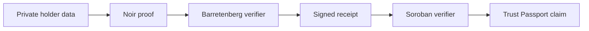

# ForgePass

**Forge Trust. Reveal Nothing.**

ForgePass is a privacy-preserving trust infrastructure layer for proving
financial credibility and eligibility without exposing the underlying data.
Noir proves private predicates, Barretenberg verifies them, and Soroban anchors
replay-safe verification receipts and non-transferable Trust Passports.

## The memorable flow

1. Review locally held financial signals.
2. Compute a deterministic private Trust Score.
3. Prove `score > 80` without disclosing score or inputs.
4. Anchor a verification receipt on Stellar Testnet.
5. Remove private values and issue a portable Trust Passport.

The included interactive product experience runs without a wallet or backend so
the full judge flow is dependable. Cryptographic and chain adapters are explicit
protocol scaffolds, not represented as deployed production infrastructure.

## Quick start

```bash
npm install
npm run dev
```

Open `http://localhost:3000`. Production checks:

```bash
npm test
npm run typecheck
npm run lint
npm run build
```

## Repository map

- `app`, `components`: premium responsive Next.js proof experience.
- `lib/domain`: score rules and canonical test vectors.
- `circuits`: Noir predicate circuits and shared design contract.
- `contracts`: Soroban verifier-receipt and passport registry scaffolds.
- `prisma`: privacy-minimized PostgreSQL metadata schema.
- `docs/BLUEPRINT.md`: architecture, diagrams, wireframes and roadmap.
- `docs/SECURITY.md`: threat model, guarantees and trust assumptions.
- `docs/DEMO.md`: live demo and video scripts.

## Architecture



## Privacy statement

ForgePass proves a predicate over supplied data. It does not make self-asserted
data truthful. Real deployments require signed source attestations, audited
circuits, an independently operated verifier quorum and an explicit retention
policy. See [the security model](docs/SECURITY.md).

## Status

Hackathon product vertical slice and protocol reference implementation. Not
audited and not suitable for production lending, compliance, or custody.

