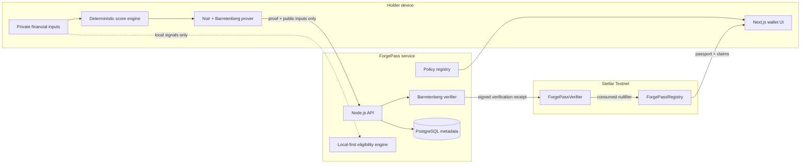
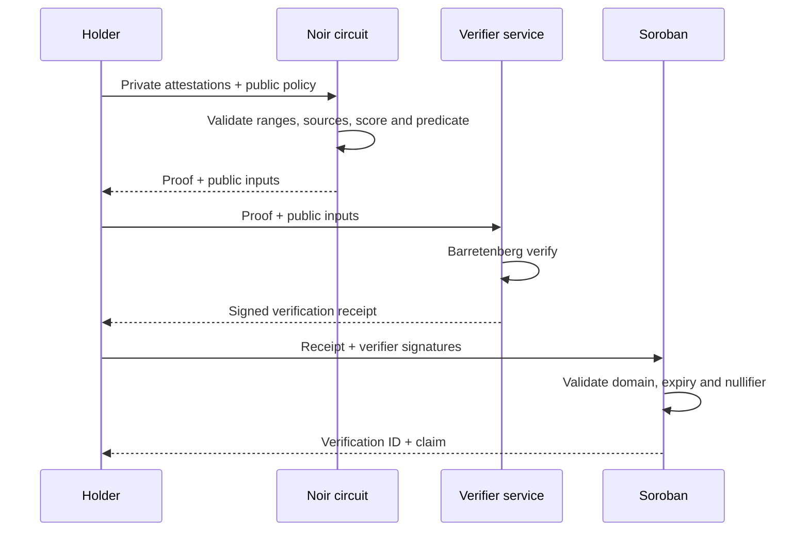
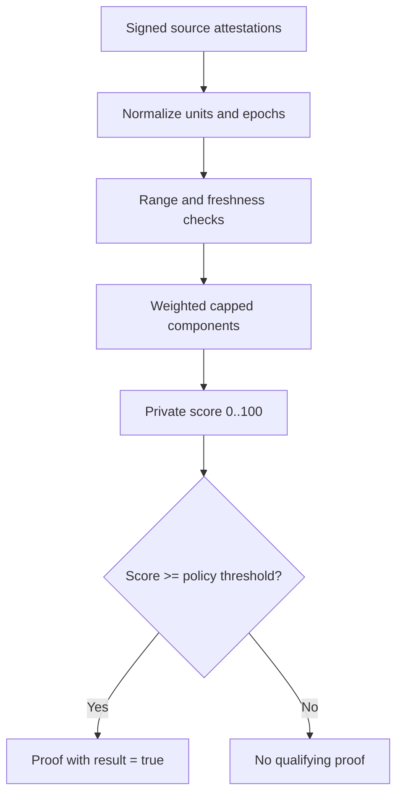
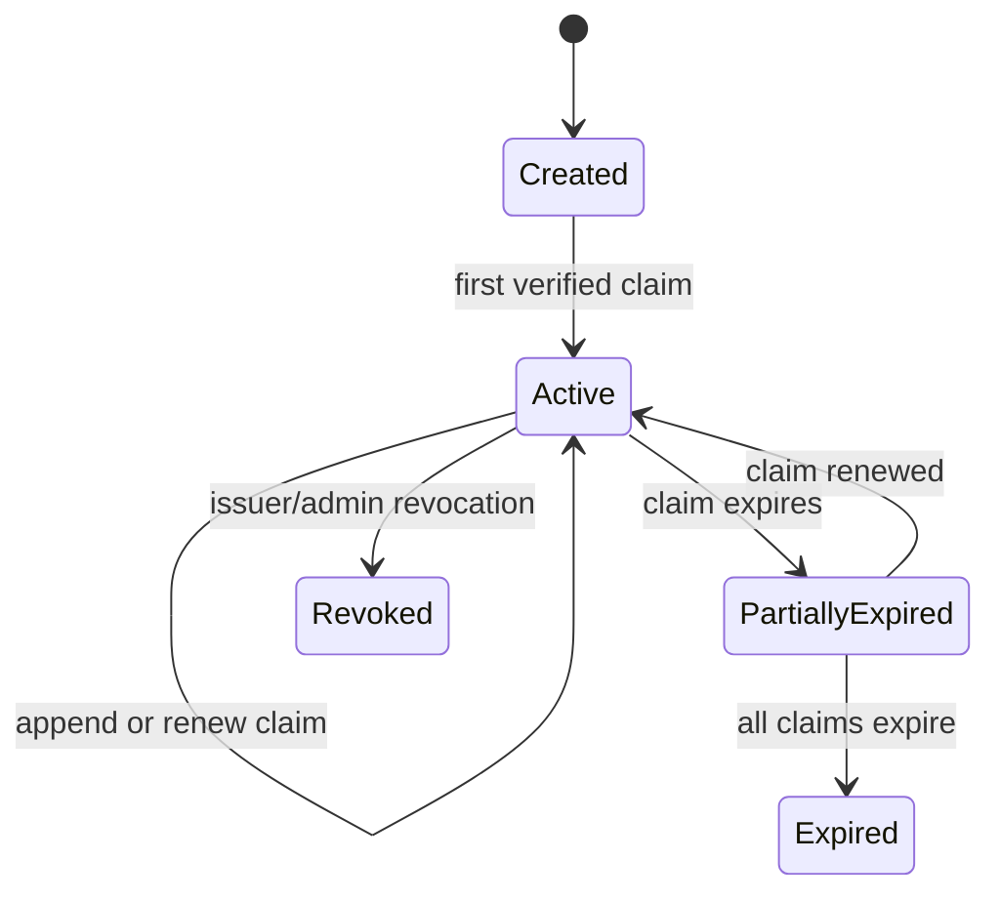
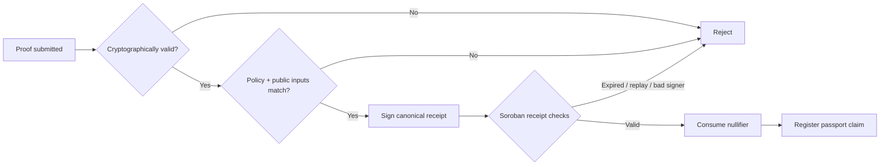

# ForgePass Technical Blueprint

> Forge Trust. Reveal Nothing.

ForgePass is a privacy-preserving trust infrastructure layer. A holder proves a
financial predicate with Noir, an authorized verifier validates the proof, and
Soroban records a replay-safe verification receipt and issues a non-transferable
Trust Passport. Raw financial data and the private trust score never leave the
holder's proof session.

## 1. Full Architecture



### Trust boundaries

1. The holder controls private inputs and proof generation.
2. The Noir circuit, not the API, enforces the predicate and score formula.
3. Barretenberg performs cryptographic proof verification off-chain.
4. `ForgePassVerifier` authenticates verifier receipts, binds them to network,
   contract, holder, policy and expiry, and consumes a unique nullifier.
5. `ForgePassRegistry` stores only commitments and verification metadata.
6. Data-source authenticity is separate from ZK correctness. Production inputs
   must be signed attestations from banks, payroll providers or Stellar indexers.

### Important implementation truth

Noir's common proving backends do not currently map to a small native Soroban
verifier without significant cryptographic engineering. The launch architecture
uses cryptographic Noir verification by Barretenberg and a threshold-authorized
verification receipt on Soroban. A future in-contract verifier can replace the
receipt adapter without changing credentials, policies or the passport registry.

## 2. Folder Structure

```text
forgepass/
|-- app/                         # Next.js App Router pages
|-- components/                  # Product UI and motion components
|-- lib/
|   |-- domain/                  # scoring, policies, commitments, types
|   |-- proof/                   # proof lifecycle and adapters
|   `-- stellar/                 # wallet and Soroban clients
|-- public/                      # static brand assets
|-- circuits/
|   |-- income_proof/
|   |-- balance_proof/
|   |-- account_age_proof/
|   |-- transaction_volume_proof/
|   `-- trust_score_proof/
|-- contracts/
|   |-- verifier/                # Soroban Rust contract
|   `-- registry/                # Soroban Rust contract
|-- packages/shared/             # shared schemas and protocol constants
|-- prisma/schema.prisma         # metadata-only PostgreSQL schema
|-- docs/                        # architecture, security, setup, demo
|-- tests/                       # domain and protocol tests
`-- .github/workflows/           # CI
```

## 3. Smart Contract Design

### ForgePassVerifier

`verify_and_consume(receipt, signatures)` validates:

- canonical receipt encoding and protocol version;
- Stellar network passphrase and verifier contract address;
- authorized verifier signature threshold;
- holder address and policy identifier;
- proof commitment and public-input commitment;
- `expires_at >= ledger_timestamp`;
- nullifier has not previously been consumed.

The contract writes `nullifier -> verification_id`, emits `proof_verified`, and
calls the registry. Admin operations rotate verifier keys, pause verification and
update the registry address. Replay prevention is atomic: a nullifier is marked
before the external registry call, and a failed transaction rolls back both.

### ForgePassRegistry

- `create_passport(holder)` creates one non-transferable passport per address.
- `register_claim(verification)` requires verifier-contract authorization.
- `revoke_claim(claim_id, reason_hash)` requires issuer/admin authorization.
- `get_passport(holder)` returns active claims and public metadata.

Stored claim fields: `claim_id`, `holder`, `proof_type`, `policy_id`,
`proof_commitment`, `issued_at`, `expires_at`, `status`, and ledger sequence.
No raw value, score, threshold, bank record, or transaction history is stored.

### Receipt domain

```text
FORGEPASS_V1 || network || verifier_contract || holder || policy_id ||
proof_type || proof_commitment || public_inputs_commitment || nullifier ||
issued_at || expires_at
```

## 4. Noir Circuit Design

All five circuits share a versioned envelope.

Private inputs:

- financial value(s);
- source-attestation payload and signature/witness;
- holder secret;
- blinding salt.

Public inputs:

- policy commitment;
- result (`1`, constrained true for an accepted proof);
- holder binding commitment;
- source/epoch commitment;
- nullifier.

The nullifier is domain separated:

```text
Poseidon(holder_secret, policy_id, source_epoch, "FORGEPASS_NULLIFIER_V1")
```

Circuits use integer/range constraints before comparison to prevent field wrap.
The policy commitment binds threshold, units, comparator, circuit version,
validity period and approved source set.

| Circuit | Private predicate |
| --- | --- |
| Income | normalized monthly income `>= policy threshold` |
| Balance | time-bounded average balance `>= policy threshold` |
| Account age | attested age in months `>= policy threshold` |
| Transaction volume | eligible transaction count `>= policy threshold` |
| Trust score | recomputed score `>= policy threshold`; score stays private |

### ZK proof flow



## 5. Trust Score Formula

The score is deterministic, integer-only and circuit-friendly:

```text
income_points      = min(monthly_income_usd * 25 / 8000, 25)
balance_points     = min(avg_balance_usd * 20 / 3000, 20)
age_points         = min(account_age_months * 20 / 24, 20)
activity_points    = min(eligible_tx_count * 20 / 120, 20)
consistency_points = min(on_time_months * 15 / observed_months, 15)
trust_score        = sum(points) // 0..100
```

Demo values (`8000`, `3000`, `18`, `120`, `12/12`) produce `95`. To preserve the
scripted score of `91`, the demo consistency input is `9/12`, producing 11 points:
`25 + 20 + 15 + 20 + 11 = 91`.

Design rules:

- Inputs are clamped to explicit safe ranges and non-negative integers.
- Division rounds down identically in TypeScript, Noir and Rust.
- Model version and weights are included in the policy commitment.
- The score is an eligibility signal, not a credit score or lending decision.
- Protected characteristics and behavioral proxies are excluded.



## 6. Database Schema

PostgreSQL is an operational index, never a private-data warehouse.

- `users`: wallet address, timestamps, terms version.
- `policies`: public policy definition, circuit version, commitment, status.
- `proof_sessions`: opaque session ID, holder, policy, state, expiry.
- `verification_receipts`: proof/public-input commitments, nullifier hash,
  verifier key ID, transaction hash, timestamps.
- `passports`: holder, contract ID, ledger ID, status.
- `credential_claims`: passport, proof type, policy, verification ID, status.
- `audit_events`: actor pseudonym, action, object IDs, timestamp, metadata.

Unique constraints cover wallet address, nullifier hash, verification ID and
transaction hash. Retention jobs delete abandoned sessions. Logs prohibit proof
bytes, wallet balances, financial inputs, scores and source payloads.

## 7. UI Wireframes

### Landing

```text
+---------------------------------------------------------------+
| FORGEPASS                         How it works  Security  [App] |
|                                                               |
|  Prove Trust Without Revealing Your Data                      |
|  ZK financial verification on Stellar.      [proof visual]    |
|  [Launch ForgePass] [Watch the flow]                           |
|                                                               |
|  PRIVATE INPUTS  ->  ZERO-KNOWLEDGE  ->  VERIFIED ON STELLAR  |
+---------------------------------------------------------------+
```

### Proof Studio / judge moment

```text
+-------------------+-------------------------------------------+
| ForgePass          | Create a Trust Score Proof                |
| Overview           | [1 Data] [2 Score] [3 Prove] [4 Verify]   |
| Proof Studio       |                                           |
| Passport           | Private vault          Proof terminal     |
| Eligibility        | Income       $8,000     Building witness   |
|                    | Balance      $3,000     Generating proof   |
|                    | Transactions 120        Stellar verified   |
|                    | Age          18 mo                         |
|                    | [Generate private score]                  |
+-------------------+-------------------------------------------+
```

At verification, private cards blur, collapse, and are replaced by a single
green `Trust Score Qualified` receipt. The passport then assembles claim by claim.

### Trust Passport

```text
+-----------------------------------+
| FORGEPASS TRUST PASSPORT          |
| G...7QK                 ACTIVE    |
| [x] Income verified              |
| [x] Balance verified             |
| [x] Account age verified         |
| [x] Transaction activity verified|
| [x] Trust score qualified         |
| Verified on Stellar Testnet       |
+-----------------------------------+
```

### Passport lifecycle



## 8. Development Roadmap

### Phase 1: Memorable vertical slice

- Premium landing and responsive Proof Studio.
- Deterministic score engine with cross-language test vectors.
- Animated private-data destruction and passport issuance.
- Wallet-ready Stellar Testnet transaction adapter with demo fallback.

### Phase 2: Cryptographic core

- Five Noir circuits and shared policy/nullifier primitives.
- Browser/WASM proving worker and Barretenberg verification service.
- Signed data-source attestation format and sample issuer.
- Negative, replay, range, mutation and stale-attestation tests.

### Phase 3: Stellar protocol

- Soroban verifier/registry contracts and contract tests.
- Multisignature verifier rotation, pause and revocation.
- Testnet deployment, contract IDs and explorer links.

### Phase 4: Production readiness

- PostgreSQL metadata index and retention jobs.
- External circuit/contract audit and ceremony documentation.
- Threshold verifier network, monitoring and incident runbooks.
- Partner SDK, policy builder and issuer onboarding.

## Verification Flow



